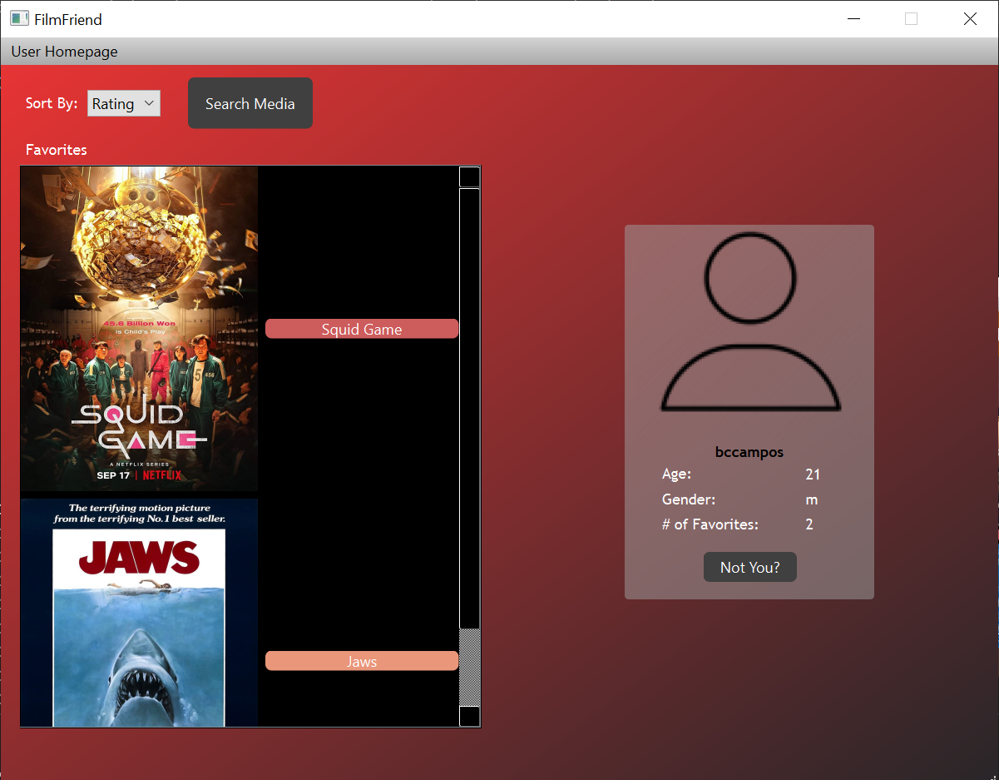

# FilmFriend User Manual
_FilmFriend_ is an application designed to let users track and favorite different movies and TV shows they've watched. Users can search for media by name, genre, and director, and can keep track of media by having a favorites list. 


1. [App Setup](#setupinstallation)
2. [App Tutorial](#tutorialhow-to-use)

# Setup/Installation - Windows
To set up FilmFriend, you must first install the required packages and necessary components. 
This includes **Python 3.8**, **PostgreSQL**, and **PyCharm6**, as well as the core FilmFriend files. 
1. [Set up Dependencies](#dependencies)
2. [Set up the Files](#files)


## Dependencies
You must first install the following dependencies before running this software:
 1. Python(3.8)
 2. PostgreSQL(12.4+)
 3. PyQT5 (5.15.1)
 4. Pip (2.21+)

After installing the dependencies, open up a window of Windows PowerShell. 
In PowerShell, begin by typing
```
> cd "(your install location)\PostgreSQL\14\bin"
```
If you installed it in the default location, the exact line to run would be
```
> cd "C:\Program Files\PostgreSQL\14\bin"
```
Then, set the environment variables PGHOST and PGPORT. 
Still in PowerShell, type
```
> set PGHOST=/tmp
```
and
```
> set PGPORT=8888
```

## Files
Open PyCharm and create a new project/virtual environment. If you are having issues setting up the venv, please refer to this link :(https://www.jetbrains.com/help/pycharm/creating-virtual-environment.html)
Click "Get from VCS" and install Git if it has not already been installed. 
Then, copy and paste the link to our repository (https://github.com/brandon-rbc/CSE412FinalProject) where it says "URL:"
Click Clone. You may be asked to log into GitHub. If so, click "Log in with GitHub," and then click the Authorize button when the new page is opened. 

## Libraries
We must install a few python libraries. To do so, open the terminal in PyCharm and run these:
```
> pip install pyside6
```
```
> pip install psycopg2-binary
```

Now, go to the folder you cloned the repository to. If you left it default, it should be C:\Users\(your username)\PycharmProjects\CSE412FinalProject 
In this folder, create a new folder called "database". 
Once you do this, go back to PowerShell and run the following command: 
```
> .\initdb C:\Users\(your username)\PycharmProjects\CSE412FinalProject\database
```
After initializing the database (you just did this), run the following command to start the database: 
```
> .\pg_ctl -D C:\Users\(your username)\PycharmProjects\CSE412FinalProject\database start
```

### If this is not working, try the following

Go to C:\Program Files\PostgreSQL\14\data (default)
Open "pg_hba.conf" in Notepad or Notepad++. 
Scroll down, and change every instance of "scram-sha-256" to trust. 

Also, type "services" in the searchbar on Windows, and open Services. 
Scroll down to postgresql-x64-14 (our default, may be named differently based on the version you download), and make sure it's not running. If it is, right click and click "stop". 

If you're still having issues, you can try doing 
```
set PGHOST=localhost
```

Now, go into PowerShell again and try running this command once more: 
```
> .\pg_ctl -D C:\Users\(your username)\PycharmProjects\CSE412FinalProject\database start
```

Now that the database is started, create a user by typing
```
> .\createdb $USER
```

This creates a user for the database. 

## Create/Fill database tables
We must make and fill our database tables for the program to interact with. This involves us changing directories to the \psql_scripts directory and running:
```
> .\psql -d $USER -f create_tables.sql
```
```
> .\psql -d $USER -f fill_tables.sql
```
## Connecting database to program
Lastly, we must make sure that our program is connecting to the correct instance of postgres running locally. To do so, locate and open the `handlers.py` file in the `\backend` directory. Once open, change the port values on line 12 and line 22 to 8888, and change the "user" values on line 9 and line 19 to your computer's username. This can be found ny typing `whoami` in a powershell terminal. (Keep in mind that this will return an all lowercased version of your username, and to verify the capitalization you can locate the `C:\Users\` folder and find the matching username.


# Tutorial/How to Use
Now that you've installed the app, here's an overview of how to use FilmFriend. 

We'll break this down into a few sections.

Pages:

1. [User Page](#User-Page)
    1. [Find Media](#find-media)
    2. [Changing User](#changing-user)
2. [Media Search](#Media-Search)
    1. [Searching](#searching)
    2. [Sorting](#sorting)
3. [Movie Info](#Movie-Info)
    1. [Favoriting](#favoriting)
    2. [Remove Favorite](#remove-favorite)
4. [Show Info](#Show-Info)

## User Page
The User Page is the home page of FilmFriend. On this page, the user can view their information (such as age, gender and # of favorites) as well as view their list of favorite movies and TV shows. This list can either be sorted by rating or title. (Visit [favoriting](#Favoriting) to learn how to add favorites).


### Find Media
To browse/search FilmFriend's title catalog, click on "Search Media" button located at the top left of the User Page. 


This will display the [Media Search](#media-search) page.


### Changing User
To change current user, click the "Not You?" button located in the user information section. 


This will display a login page where you can enter in new user information. Click "Log In" button on the bottom of this page to log in.


## Media Search
On the Media Search page, users can browse FilmFriend's extensive media collection.


### Searching
To search for specific movies/shows, first type in desired search query in the text box (ex. "Squid Game"). 


Then, select corresponding category from "Search By" drop-down menu (ex. "Title).


The resulting movies/shows will then populate the screen below.

### Sorting
To sort movies/shows, select desired sort criteria (ex. "Rating").


This sort will be performed on whichever movies/shows are displayed in the screen below.


## Movie Info
After clicking on a movie title on either the User Page or Media Search Page, the Movie Info page of that specific movie will be displayed. This page contains various information about the movie (Title, Director, Rating, etc.)


### Favoriting
On the Movie Info page, users can choose to add the movie to their favorites list. To do this, simply click the "Add to Favorites" button on the bottom of the Movie Info window. Once a movie is added to favorites, it will then be displayed in the User Page.


### Remove Favorite
If a movie is already in a user's favorite list, the user can remove by clicking the "Remove from Favorites" button on the bottom of the Movie Info window. Once a movie is removed from favorites, it will also be removed from the User Page.


## Show Info
After clicking on a show title on either the User Page or Media Search Page, the Show Info page of that specific show will be displayed. This page contains various information about the show (Title, Director, Rating, etc.)


To add/remove show from favorites, follow [favoriting](#favoriting) or [remove favorite](#remove-favorite) in Movie Info section.
